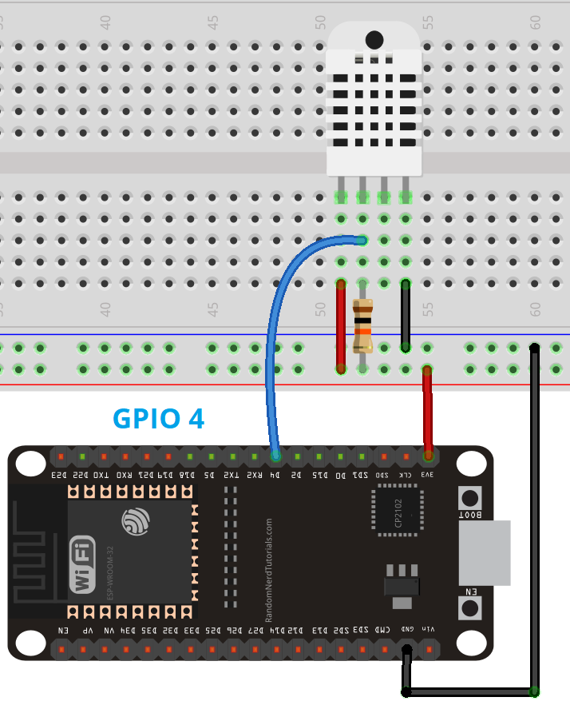
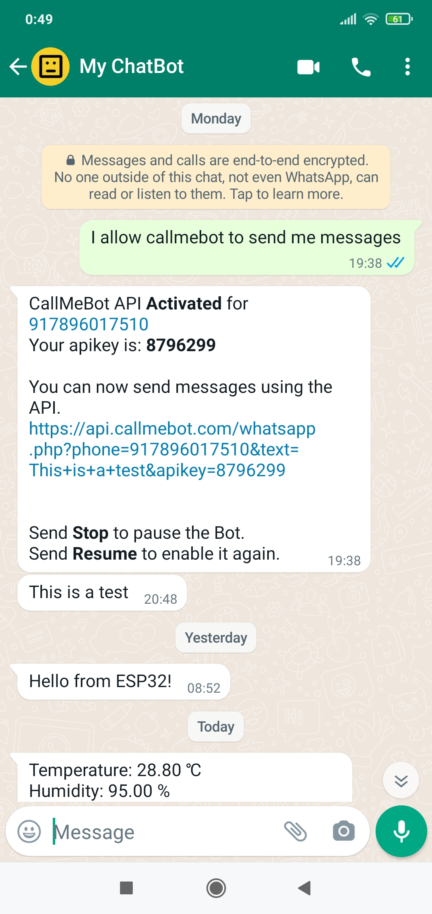
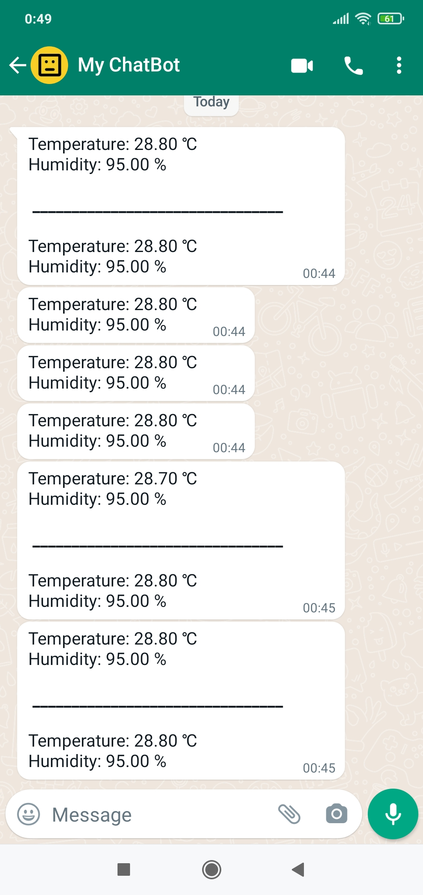
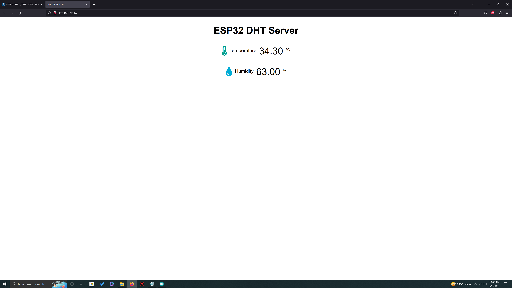
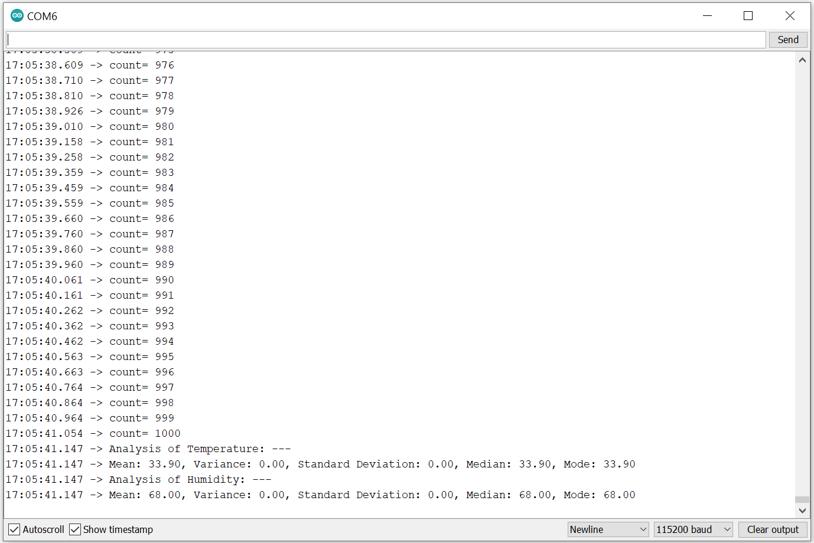
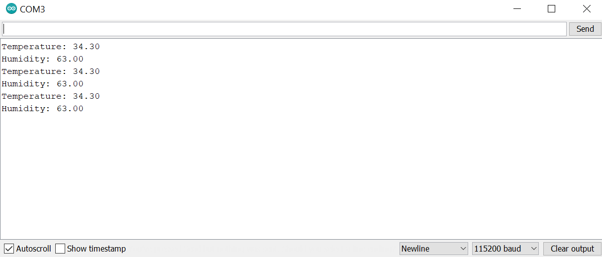

# ESP32 Weather Notifier

## Project Overview
This project implements an **ESP32-based asynchronous web server** to monitor temperature and humidity data from a DHT11 sensor in real-time. Additionally, the server sends **automated WhatsApp notifications** of sensor readings to specified contacts.

## Features
- **Real-Time Data Monitoring**: Live temperature and humidity data available via a web server.
- **WhatsApp Notifications**: Automated updates sent through the CallMeBot API.
- **Statistical Analysis**: Script for extended analysis of collected sensor data, including mean, variance, standard deviation, median, and mode.

## Components
- ESP32 MCU (MicroController Unit)
- DHT11 temperature and humidity sensor
- Breadboard and connecting wires
- Resistor (1kΩ)

## Setup Instructions

1. **Arduino Library Setup**:  
   - Install the "DHT library" and "Adafruit Unified Sensor" library from Arduino Library Manager.
   - Include the ESP32 board package by adding the following URL to **Additional Board Manager URLs** in Arduino Preferences:
     ```
     https://raw.githubusercontent.com/espressif/arduino-esp32/gh-pages/package_esp32_index.json
     ```
     
2. **Connection Diagram**:  
   

3. **Arduino Code Upload**:
   - Use `ESP32_WebServer_DHT11_WhatsApp.ino` as the main code for uploading to ESP32.
   - `extra_StatisticalAnalysis.ino` contains additional statistical analysis.

4. **WhatsApp API Setup**:
   - Configure the CallMeBot API for WhatsApp notifications by entering your phone number and API key in the code.
   -   
     

> **Note**: Replace personal information in the code (such as SSID, Wi-Fi password, phone number, and API key) with your own details, and ensure you keep this information secure.

## Web Interface
  
The web server allows users to view current temperature and humidity readings on any device with a browser.

## Statistical Analysis
For extended data insights, the additional script performs statistical analysis on the sensor readings, providing:
- **Mean**
- **Variance**
- **Standard Deviation**
- **Median**
- **Mode**



## Results and Demonstrations

- **Serial Monitor Output**:  
  The data streamed from the ESP32 for debugging.
  

- **Real-Time Plots**:  
  Graphical data representations using Arduino’s Serial Plotter.
  

## Conclusion
The ESP32 Weather Notifier demonstrates an IoT application with real-time data monitoring and automated messaging. The flexibility of the ESP32 and DHT11 sensor combination allows for numerous IoT applications.

## References
- Truong, Hong Kha. “Temperature and humidity monitor with ESP8266.” [Theseus](https://www.theseus.fi/handle/10024/262546)
- [ESP32-DHT11 Web Server Tutorial](https://randomnerdtutorials.com/esp32-dht11-dht22-temperature-humidity-web-server-arduino-ide/)
- [CallMeBot WhatsApp API Guide](https://randomnerdtutorials.com/esp32-send-messages-whatsapp/)
